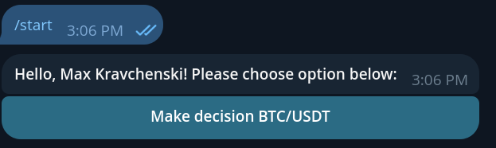
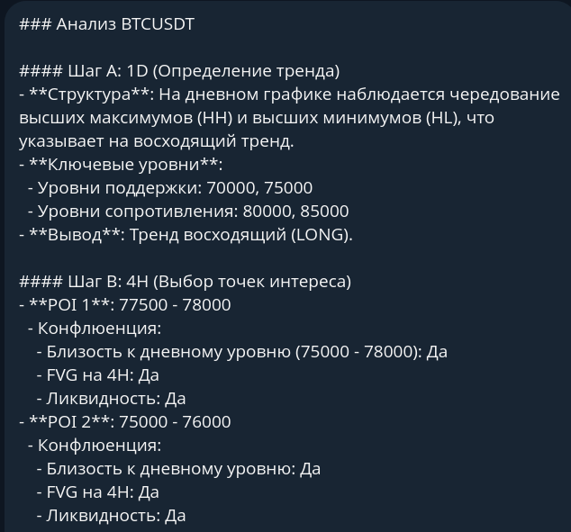

<div align="center">

# 🚀 Kolxoz Trading Telegram Bot

[](https://www.python.org/)
[](https://docs.aiogram.dev/)
[](https://docs.agno.com/)
[](https://opensource.org/licenses/MIT)
[](https://github.com/AiTradeDevelopment/kolxoz_trading_telegram_bot/stargazers)
[](https://github.com/AiTradeDevelopment/kolxoz_trading_telegram_bot/commits/main)

<!-- Logo -->
<br>
<a href="https://github.com/AiTradeDevelopment/kolxoz_trading_telegram_bot">
  
</a>

**AI-Powered Cryptocurrency Trading Assistant for Telegram**  
Real-time market analysis using ICT/SMC methodology with LLM-driven trade decisions

[✨ Features](#-features) • [🚀 Quick Start](#-quick-start) • [🏗️ Architecture](#-architecture) • [📁 Project Structure](#-project-structure) • [📄 License](#-license)

</div>

---

## 📸 Screenshots

<div align="center">
  
  
  <br>
  <b>Interactive Telegram interface with AI-generated trading signals</b>
</div>

---

## 🎯 Overview

Kolxoz Trading Bot is a Telegram bot that provides intelligent cryptocurrency trading analysis and signals. It fetches real-time market data from multiple sources and uses Large Language Models (via NVIDIA NIM) to generate structured trading decisions based on professional ICT/SMC methodology.

### Key Highlights

- 🤖 **LLM-Powered Analysis** — Uses NVIDIA NIM with models like Devstral and DeepSeek-V4 for multi-timeframe market analysis
- 📊 **Real-Time Data** — Binance OHLCV candles, TradingView indicators, crypto news aggregation
- 🎯 **ICT/SMC Methodology** — Institutional-grade trading framework with structured scoring
- ⚡ **Async-First** — Built on `aiogram` and `asyncio` for responsive Telegram interactions
- 🔒 **Type-Safe** — Pydantic models for trade decisions, score breakdowns, and risk management
- 🌍 **Russian Language** — All AI outputs are translated to Russian for the target audience

---

## ✨ Features

### Core Capabilities

- **🔄 Automated Trading Signals**
  - LONG / SHORT / WAIT recommendations with confidence scores (0–10)
  - Take Profit (TP) and Stop Loss (SL) calculations
  - Risk-to-Reward (RR) ratio analysis — only recommends trades with RR ≥ 1.6
  - Entry price suggestions based on impulse candle retests

- **📊 Multi-Timeframe Analysis**
  - 1D bias detection (HH+HL / LH+LL structure)
  - 4H Point of Interest (POI) selection with confluence validation
  - 1H setup readiness (sweep detection, liquidity analysis)
  - 15m trigger confirmation (CHOCH, candlestick patterns, iFVG)

- **📰 Market Data Integration**
  - Binance API — OHLCV candles for multiple timeframes
  - TradingView — Technical indicators and pivot levels
  - CryptoPanic — Real-time crypto news with sentiment
  - CoinDesk — Industry headlines and market analysis

- **📋 Structured Output**
  - Detailed score breakdown across 8 criteria
  - Structured TP/SL/RR data
  - 5-sentence summary explaining the decision

> ⚠️ **Note:** Currently supports **BTC/USDT** only. Multi-pair support is on the [roadmap](#-roadmap).

---

## 📋 Example Signal Output

When a user clicks "Make decision BTC/USDT", the bot returns a structured signal like this:

```
🟢 DECISION: LONG | BTCUSDT
📊 Score: 9/10

Score Breakdown:
  1D Bias:        +2
  POI Confluence: +2
  Sweep:          +2
  CHOCH Retest:   +2
  Candle Confirm: +1
  Impulse/FVG:    +1
  News Penalty:   0
  Structure:      -1

💰 Entry: 67420.50
  TP:    68500.00
  SL:    66800.00
  RR:    1.85

📝 Summary:
1) 1D structure shows clear bullish HH+HL formation.
2) 4H POI at 67300–67500 has strong confluence with 1D FVG.
3) 1H sweep of equal lows at 67280 followed by reclaim.
4) 15m CHOCH confirmed with bullish engulfing candle.
5) LONG entry because score ≥ 8, RR = 1.85, and all criteria met.
```

---

## 🤖 Bot Commands

| Command | Description |
|---------|-------------|
| `/start` | Launch the bot and show the main menu |
| `Make decision BTC/USDT` (button) | Generate a fresh AI trading signal |
| `Back` (button) | Return to the main menu |

---

## 🚀 Quick Start

### Prerequisites

- **Python 3.13+**
- **uv** — Ultra-fast Python package manager
  ```bash
  curl -LsSf https://astral.sh/uv/install.sh | sh
  ```
- **Telegram Bot Token** from [@BotFather](https://t.me/botfather)
- **NVIDIA API Key** from [NVIDIA NIM](https://build.nvidia.com/)

### Installation

```bash
# Clone the repository
git clone https://github.com/AiTradeDevelopment/kolxoz_trading_telegram_bot.git
cd kolxoz_trading_telegram_bot

# Install dependencies
uv sync
```

### Configuration

Copy the example environment file and fill in your keys:

```bash
cp .env.example .env
```

Then edit `.env` with your credentials:

```properties
# Required
BOT_TOKEN=your_telegram_bot_token_from_botfather
NVIDIA_API_KEY=your-nvidia-api-key-here

# Optional
MCP_TIMEOUT=60
OPENAI_API_URL=https://integrate.api.nvidia.com/v1/
COINDESK_API_KEY=your-coindesk-api-key-here
CRYPTOPANIC_TOKEN=your-cryptopanic-token-here
AGNO_TELEMETRY=false
```

| Variable | Required | Description |
|----------|----------|-------------|
| `BOT_TOKEN` | ✅ Yes | Telegram bot token from [@BotFather](https://t.me/botfather) |
| `NVIDIA_API_KEY` | ✅ Yes | API key for NVIDIA NIM LLM inference |
| `MCP_TIMEOUT` | ❌ No | Timeout for MCP tool calls (default: 60s) |
| `OPENAI_API_URL` | ❌ No | Custom base URL for OpenAI-compatible APIs |
| `COINDESK_API_KEY` | ❌ No | API key for CoinDesk news feed |
| `CRYPTOPANIC_TOKEN` | ❌ No | Token for CryptoPanic news aggregation |
| `AGNO_TELEMETRY` | ❌ No | Set to `false` to disable Agno telemetry |

### Running the Bot

```bash
# Run with uv (recommended)
uv run main.py

# Or activate venv first
source .venv/bin/activate
python main.py
```

> 💡 **Tip:** The bot will start polling Telegram for messages. Make sure your `BOT_TOKEN` is valid and the bot is not blocked.

---

## 🏗️ Architecture

```mermaid
graph LR
    User[Telegram User] -->|/start| Bot[Telegram Bot aiogram]
    Bot -->|Callback: decision| Handler[Start Handler]
    Handler -->|get_decision()| Agent[Agno Agent]
    Agent -->|LLM| NIM[NVIDIA NIM API]
    Agent -->|Tools| Data[Data Sources]
    
    subgraph "Data Sources"
        Data --> Binance[Binance Candles]
        Data --> TV[TradingView Data]
        Data --> News[Crypto News]
        Data --> Pivot[Pivot Levels]
    end
    
    Agent -->|TradeDecision| Formatter[Text Formatter]
    Formatter -->|Edit message| Bot
    Bot -->|Signal| User
```

### Data Flow

1. **User Interaction** — Sends `/start` or clicks "Make decision BTC/USDT"
2. **Thinking State** — Bot shows "I'm thinking🤔" message
3. **Data Collection** — Agent fetches all market data in parallel via tools:
   - Binance candles: 1d (365), 4h (180), 1h (120), 15m (200)
   - TradingView indicators and pivot levels
   - CryptoPanic and CoinDesk news
4. **AI Analysis** — LLM analyzes data using ICT/SMC framework and outputs structured JSON
5. **Result Formatting** — `TradeDecision` Pydantic model formats the output with emojis and tables
6. **Delivery** — Bot edits the thinking message with the final trading signal

---

## 📁 Project Structure

```
kolxoz_trading_telegram_bot/
├── main.py                          # Application entry point
├── pyproject.toml                   # Project dependencies (uv)
├── .env.example                     # Environment variables template
│
├── bot/
│   ├── initialize_bot.py            # Bot & Dispatcher initialization
│   │
│   ├── handlers/
│   │   └── start.py                 # /start command & callback handlers
│   │
│   ├── keyboards/
│   │   └── inline/
│   │       └── menu.py              # Inline keyboard definitions
│   │
│   ├── utils/
│   │   ├── get_decision.py          # Agent invocation wrapper
│   │   └── clean_text.py            # Text sanitization utilities
│   │
│   └── agents/
│       ├── agent.py                 # Agno Agent configuration
│       ├── prompts/
│       │   └── trading_strategy.py  # ICT/SMC system prompt
│       ├── models/
│       │   ├── trade_decision.py    # Main output Pydantic model
│       │   ├── score_breakdown.py   # Scoring criteria model
│       │   └── tpsl.py              # TP/SL/RR model
│       ├── mcp_tools/
│       │   ├── get_binance_candles.py
│       │   ├── get_tradingview_data.py
│       │   ├── get_pivot_levels.py
│       │   ├── get_cryptopanic_news.py
│       │   └── get_cryptonews.py    # CoinDesk news
│       └── mcp_run/
│           └── fetch.py             # MCP data fetch utilities
│
├── tests/                           # Test suite
├── docs/
│   └── assets/                      # Screenshots & logo
└── README.md
```

---

## 📦 Tech Stack

| Technology | Purpose |
|------------|---------|
| **Python 3.13+** | Core language |
| **aiogram 3.x** | Telegram Bot Framework |
| **agno** | AI Agent orchestration |
| **pydantic v2** | Data validation & structured outputs |
| **httpx** | Async HTTP client |
| **NVIDIA NIM** | LLM inference (Devstral / DeepSeek-V4) |
| **Binance API** | OHLCV market data |
| **TradingView** | Technical indicators |
| **CryptoPanic / CoinDesk** | Crypto news aggregation |

Full dependency list in [`pyproject.toml`](pyproject.toml).

---

## 🧪 Testing

```bash
# Run all tests
uv run pytest tests/ -v

# With coverage report
uv run pytest tests/ -v --cov=bot --cov-report=html
```

---

## 🛠️ Trading Strategy

The bot employs a strict top-down ICT/SMC (Inner Circle Trader / Smart Money Concepts) methodology:

### Scoring System (Entry only if score ≥ 8)

| Criterion | Points | Description |
|-----------|--------|-------------|
| 1D Bias Alignment | +2 | Trade direction matches daily structure |
| POI Confluence | +2 | 2 of 3 confluence factors met |
| Sweep | +2 | Liquidity sweep on 1H (or +1 on 15m) |
| CHOCH + Retest | +2 | Change of Character confirmed with retest |
| Candle Confirmation | +1 | Engulfing / rejection wick / break&retest |
| Impulse / iFVG | +1 | Strong momentum or inverse FVG reaction |
| News Penalty | −2/−1 | High-impact news against direction |
| Structure Penalty | −1 | Daily structure neutral/ranging |

### Hard WAIT Conditions

- Price not in a valid Point of Interest
- No sweep + no 15m CHOCH
- CHOCH present but no candlestick confirmation
- Risk-to-Reward to TP1 < 1.6
- Fresh high-impact news against the trade without a perfect setup

---

## 🗺️ Roadmap

- [ ] Support for multiple trading pairs (ETHUSDT, SOLUSDT, etc.)
- [ ] User-specific settings and preferences
- [ ] Signal history and performance tracking
- [ ] Webhook-based real-time alerts
- [ ] Integration with additional LLM providers (OpenAI, Mistral, local models)
- [ ] Backtesting module for strategy validation
- [ ] Docker support for easier deployment
- [ ] Redis caching for market data
- [ ] Multi-language support

---

## ⚠️ Disclaimer

> This bot is for **educational and informational purposes only**. It does not execute trades, manage funds, or provide financial advice. Always do your own research (DYOR) before making any trading decisions. Cryptocurrency trading involves substantial risk of loss.

---

## 🤝 Contributing

Contributions are welcome! Please feel free to submit a Pull Request.

1. Fork the repository
2. Create your feature branch (`git checkout -b feat/amazing-feature`)
3. Commit your changes (`git commit -m 'feat: add some feature'`)
4. Push to the branch (`git push origin feat/amazing-feature`)
5. Open a Pull Request

---

## 📄 License

Distributed under the MIT License. See [LICENSE](LICENSE) for more information.

```
MIT License

Copyright (c) 2024-2026 Kolxoz Development Team

Permission is hereby granted, free of charge, to any person obtaining a copy
of this software and associated documentation files (the "Software"), to deal
in the Software without restriction, including without limitation the rights
to use, copy, modify, merge, publish, distribute, sublicense, and/or sell
copies of the Software, and to permit persons to whom the Software is
furnished to do so, subject to the following conditions:

The above copyright notice and this permission notice shall be included in all
copies or substantial portions of the Software.
```

---

## 🙏 Acknowledgments

- [Telegram](https://telegram.org/) & [aiogram](https://docs.aiogram.dev/) for the bot framework
- [Agno](https://docs.agno.com/) for the AI agent infrastructure
- [NVIDIA NIM](https://build.nvidia.com/) for LLM inference hosting
- [Binance](https://www.binance.com/) for market data APIs
- [CryptoPanic](https://cryptopanic.com/) & [CoinDesk](https://www.coindesk.com/) for news data

---

## 📞 Contact

- **GitHub Issues**: [Report bugs or request features](https://github.com/AiTradeDevelopment/kolxoz_trading_telegram_bot/issues)
- **Email**: hello@kolxoz.dev

---

<div align="center">

**Made with ❤️ by the Kolxoz Team**

_AI-Powered Trading for the Next Generation_

[⬆ Back to top](#-kolxoz-trading-telegram-bot)

</div>
